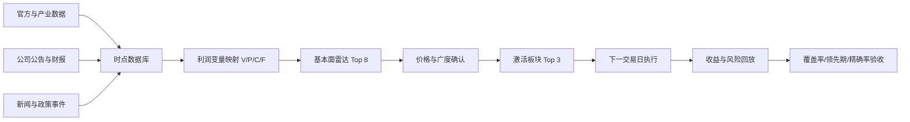

# A股板块领先信号与回测验证系统设计报告

| 项目 | 内容 |
|---|---|
| 版本 | v0.1 |
| 发布日期 | 2026-07-15 |
| 研究对象 | A股行业板块与产业链热点 |
| 文档状态 | 方法设计稿，尚未填写实证回测结果 |

> 本报告设计一套可审计、可回放、可证伪的板块发现系统，目标是在年度大涨板块完成主要涨幅之前，将其纳入有限候选池。本报告不是个股或板块推荐，也不构成投资建议。

---

## 一、执行摘要

本系统不直接预测“明年涨幅前三”，而是每周回答四个问题：

1. 哪些产业的供需、订单或产品周期正在改善？
2. 改善能否传导到上市公司利润和现金流？
3. 市场是否开始确认，但尚未充分交易？
4. 在严格限制候选数量后，能否提前覆盖后续的大涨板块？

系统分成两个信号层：

- **基本面雷达：** 每周最多保留8个候选板块，负责提前发现。
- **交易激活层：** 最多激活3个板块，负责确认趋势并控制错误信号。

建议的核心验收目标是：

| 指标 | 目标 |
|---|---:|
| 2025年与2026年上半年涨幅前三覆盖率 | 至少5/6，目标6/6 |
| 每周雷达池板块数 | 不超过8个 |
| 每周激活板块数 | 不超过3个 |
| 中位领先时间 | 不少于20个交易日 |
| 雷达候选未来60日进入板块涨幅前25%的比例 | 不低于45% |

仅仅“命中过年度前三”不够。如果候选池过大、信号发生在涨幅后段，或者回测使用了当时尚未发布的数据，都不能算有效覆盖。

## 二、测试目标与统一口径

### 2.1 板块口径

推荐优先采用以下一种固定口径：

- 有Wind或iFinD授权数据：申万一级31个行业用于年度验收，申万二级用于定位细分产业链。
- 无商业数据：采用中证全指35个二级行业，并用其历史成分和指数数据完成回放。

概念板块不作为主要回测标签。AI算力、机器人、低空经济等动态概念可以作为产业链标签，但必须映射到当时已经存在的股票和固定行业，不能使用今天的概念成分回填过去。

### 2.2 2025与2026挑战集

根据公开市场复盘，2025年申万一级行业涨幅前三大致为有色金属、通信和电子；2026年尚未结束，因此只将截至2026年6月30日的电子、通信和建筑材料作为上半年挑战目标。

| 测试期 | 公开复盘中的前三板块 | 状态 |
|---|---|---|
| 2025全年 | 有色金属、通信、电子 | 完整年度 |
| 2026上半年 | 电子、通信、建筑材料 | 非完整年度 |

不同媒体可能采用价格指数、全收益指数、市值加权或个股算术平均，数值会有差异。正式回测必须从同一数据源重新计算所有行业收益率，以上名单只用于设计阶段的外部一致性检查。

## 三、系统总览



其中：

- `V`：销量、订单或渗透率；
- `P`：产品售价或平均销售价格；
- `C`：原材料、能源、运费和制造成本；
- `F`：固定费用、折旧和经营杠杆。

所有跨行业指标最终都映射到这四个利润变量，避免系统退化成无法解释的新闻热词排行榜。

## 四、数据组织方式

底层建议采用DuckDB或SQLite，上层使用Python生成信号，Excel或网页仪表盘负责审阅。数据应采用追加式保存，不覆盖历史版本。

### 4.1 核心数据表

| 表名 | 用途 | 关键字段 |
|---|---|---|
| `sector_master` | 板块定义与分类版本 | `sector_id`、层级、生效日、失效日 |
| `sector_membership` | 股票历史所属板块 | 股票代码、权重、生效日、失效日 |
| `market_daily` | 指数与市场行情 | 收盘价、全收益值、成交额、涨跌家数 |
| `indicator_vintage` | 产业高频指标 | 数据日、发布日期、指标、数值、单位、来源 |
| `news_event` | 结构化产业事件 | 发布时间、板块、利润变量、方向、可信度 |
| `financial_vintage` | 财报和业绩预告 | 报告期、公告日、原始值、修订版本 |
| `signal_snapshot` | 每周信号快照 | 截止时间、特征值、总分、排名、模型版本 |
| `backtest_trade` | 回测成交与持仓 | 决策日、执行日、价格、成本、退出原因 |

### 4.2 防止前视偏差的时间字段

每条数据至少保留两个时间：

- `observation_date`：数据描述的业务日期；
- `available_at`：投资者真正可以获得数据的时间。

回测查询必须满足：

```text
available_at <= signal_timestamp
```

例如，一季度利润属于3月31日，但只能从正式公告后的下一交易日进入模型。宏观数据修订、行业分类调整和财报更正也必须按版本保存，不能用最新值覆盖旧值。

## 五、产业指标按利润机制分组

### 5.1 价差型

适用于有色、化工、钢铁、建材、能源等板块。

核心指标：

- 产品价格及其1个月、3个月变化；
- 原材料价格与产品价差；
- 行业库存及库存周转；
- 开工率、检修和有效产能；
- 新增产能预计投放时间；
- 进出口数量和近似单价。

理想组合是“产品价差扩大、库存下降、需求增长、新供给延后”。只有产品涨价而库存同步上升，可能只是囤货或短期交易。

### 5.2 订单型

适用于通信设备、电力设备、机械、军工及资本品行业。

核心指标：

- 客户资本开支和招标规模；
- 上市公司在手订单、合同负债和预收款；
- 交付周期、产能利用率和扩产计划；
- 订单增长公司占板块公司的比例；
- 经营现金流是否同步改善。

### 5.3 产品周期型

适用于电子、消费电子、创新药和新兴消费品。

核心指标：

- 新产品渗透率、销量与平均售价；
- 渠道库存和客户排产；
- 制造良率和单位成本；
- 重点客户收入、出口和产品认证；
- 研发里程碑及商业化进度。

同一一级行业可以包含多种利润机制。例如建筑材料板块上涨时，需要识别驱动力究竟来自水泥地产链，还是玻纤、电子布等电子上游材料。

## 六、新闻事件结构化

新闻只负责提出假设，不能直接形成交易结论。每条新闻转换为以下事件记录：

| 字段 | 示例 |
|---|---|
| 产业链 | 通信—光模块 |
| 映射板块 | 通信 |
| 利润变量 | 销量 `V` |
| 方向 | `+1` |
| 幅度 | 1—3 |
| 持续性 | 短期、季度、年度 |
| 可信度 | A、B、C、D |
| 发布时间 | 精确到分钟 |
| 验证指标 | 云厂商资本开支、出口、订单 |
| 状态 | 假设、确认、证伪 |

事件分数采用衰减方式：

```text
事件分数 = 方向 × 幅度 × 可信度权重 × exp(-经过天数 / 半衰期)
```

建议可信度权重：

| 等级 | 来源 | 权重 |
|---|---|---:|
| A | 政府、交易所、公司法定公告 | 1.0 |
| B | 行业协会、客户或供应商官方信息 | 0.7 |
| C | 主流媒体、调研纪要 | 0.4 |
| D | 自媒体和未验证传闻 | 0，不进入正式模型 |

## 七、两阶段信号

### 7.1 基本面雷达

每周五收盘后，对全部板块进行横截面标准化和排名：

```text
雷达总分 =
35% × 供需/订单改善
+ 25% × 盈利扩散
+ 15% × 结构化事件
+ 15% × 市场初步确认
+ 10% × 估值与拥挤度
```

各模块含义：

- **供需/订单改善：** 价差、库存、开工率、出口、订单的趋势和加速度；
- **盈利扩散：** 业绩预告上修比例、利润加速公司占比、板块毛利率中位数变化；
- **结构化事件：** A/B级产业事件的方向、强度、持续性与时间衰减；
- **市场初步确认：** 20日相对收益、上涨家数和成交额占比；
- **估值与拥挤度：** 历史估值分位、换手率和持仓集中度，主要作为惩罚项。

每周排名前8进入雷达池，连续两周进入前8才成为“确认候选”。

### 7.2 交易激活

确认候选满足以下三项中的两项，才进入激活池：

1. 20日相对中证全指或沪深300收益转正；
2. 板块内站上60日均线的成分股比例持续上升；
3. 板块成交额占比上升，但未进入历史极端拥挤区。

激活池最多保留总分最高的3个板块。这样将“提前发现”与“可交易确认”分开，避免基本面正确但市场迟迟不响应，也避免只做价格追涨。

## 八、提前覆盖的客观定义

### 8.1 年度标签

每个测试期按统一板块全收益指数计算涨幅前三。2026年暂以6月30日作为上半年终点。

### 8.2 涨幅完成度

```text
涨幅完成度(t) =
(指数(t) / 期初指数 - 1)
÷
(期末指数 / 期初指数 - 1)
```

一个年度前三板块同时满足以下条件，才算被“提前覆盖”：

1. 在涨幅完成度低于30%时进入雷达前8；
2. 至少连续两周处于雷达前8；
3. 首次入选距离完成30%涨幅至少10个交易日；
4. 首次入选时，过去60日涨幅排名尚未进入行业前三。

第四项用于防止把行情后段的动量追涨包装成领先发现。

## 九、回测执行协议

### 9.1 数据切分

| 时段 | 用途 | 是否允许调参 |
|---|---|---|
| 2014—2022 | 训练与确定指标方向 | 允许 |
| 2023—2024 | 参数验证 | 仅允许有限调整 |
| 2025 | 回溯挑战集 | 不允许 |
| 2026上半年 | 第二回溯挑战集 | 不允许 |
| 2026-07-15以后 | 前瞻样本外 | 不允许 |

由于本方法是在看到2025、2026表现后形成的，这两个时期不能被宣称为真正的样本外结果。最诚实的做法是冻结v0.1参数和代码哈希，从2026-07-15开始记录不可修改的前瞻信号。

### 9.2 调仓与交易

- 每周五收盘后生成信号；
- 下一交易日开盘或VWAP执行；
- 激活板块等权配置，最多3个；
- 排名连续两周跌出前12时退出；
- 若供需逻辑证伪或财务质量触发否决，提前退出；
- 对单边10、30、50bp交易成本分别进行压力测试；
- 指数研究回测与实际ETF可交易回测分开呈现。

### 9.3 必须排除的偏差

- 使用最新行业成分回测历史；
- 使用后来修订的宏观或财务数据；
- 财报在报告期末而不是公告日进入模型；
- 用2025、2026结果反向调整指标权重；
- 忽略停牌、涨跌停、ETF上市日期和交易成本；
- 只报告最佳参数，不报告参数邻域结果。

## 十、验收指标

回测报告必须同时展示识别能力和投资结果。

### 10.1 识别能力

| 指标 | 定义 |
|---|---|
| `Recall@Top3` | 年度前三中被提前覆盖的板块比例 |
| `Precision@Radar` | 雷达候选未来60日进入行业涨幅前25%的比例 |
| `Median Lead Days` | 首次有效信号到30%涨幅完成点的中位交易日数 |
| `False Positive Rate` | 入选后60日明显跑输基准的候选比例 |
| `Radar Breadth` | 每周雷达池的平均和最大板块数 |

### 10.2 投资结果

- 年化收益和相对中证全指超额收益；
- 最大回撤、波动率和Calmar比率；
- 月度胜率和年度胜率；
- 换手率及交易成本敏感性；
- 最差年份和最差连续12个月；
- 收益是否依赖单一行业或单一时期。

如果模型通过扩大候选池轻易覆盖年度前三，但精确率和组合收益没有提升，应判定为不合格。

## 十一、公司质量与估值过滤

板块信号通过后，如果最终交易个股，需要增加独立的质量门槛：

- 能用一段话解释公司如何赚钱及利润敏感性；
- 经营现金流不能长期明显落后于净利润；
- 应收账款和存货不能持续快于收入增长；
- 收入下降30%的压力情景下仍能偿债；
- 管理层诚信、审计意见和关联交易不存在否决性问题；
- 使用正常化利润估值，而不是用景气顶点利润简单外推。

公司质量负责减少个股事故，不能反过来替代板块信号。第一阶段建议先用行业全收益指数验证发现能力，再单独验证ETF或个股组合的可交易性。

## 十二、每周输出样式

每周雷达报告建议只展示一页核心信息：

| 排名 | 板块 | 利润模板 | 雷达分 | 连续入选 | 核心领先指标 | 价格状态 | 估值/拥挤 | 状态 |
|---:|---|---|---:|---:|---|---|---|---|
| 1 | 示例A | 订单型 | 82 | 3周 | 订单与合同负债加速 | 初步确认 | 中性 | 激活 |
| 2 | 示例B | 价差型 | 78 | 2周 | 价差扩大、库存下降 | 尚未确认 | 低 | 雷达 |
| 3 | 示例C | 产品周期型 | 73 | 1周 | 排产与渗透率改善 | 已拥挤 | 高 | 观察 |

每个候选同时记录：

- 三项支持证据；
- 两项待验证数据；
- 三项证伪条件；
- 下一次数据发布日期；
- 首次入选时的价格和涨幅完成度；
- 模型版本与数据快照哈希。

## 十三、实施顺序

### 阶段1：最小可用回测

1. 固定申万一级或中证全指二级行业口径；
2. 导入历史指数、成分股和公告时间；
3. 先实现市场、财务和少量官方产业指标；
4. 生成2014年以来的周度时点快照；
5. 运行无新闻文本模型的基础回测。

### 阶段2：产业数据与事件层

1. 为价差型、订单型、产品周期型板块配置指标字典；
2. 结构化官方公告、政策和高可信产业新闻；
3. 建立事件衰减和后续验证状态；
4. 比较加入事件层前后的增量贡献。

### 阶段3：前瞻运行

1. 冻结v0.1参数、代码版本和数据字典；
2. 每周自动生成雷达快照；
3. 快照提交到Git，形成不可篡改的时间记录；
4. 每月只复盘，不修改历史信号；
5. 每半年决定是否发布新模型版本。

## 十四、关键风险与结论

最大的三个风险是：

1. **数据窥探：** 在知道年度前三后反向寻找能解释它们的指标；
2. **时点错误：** 使用最新成分、修订数据或提前可见的财报；
3. **虚假覆盖：** 用过大的候选池和已经启动的价格动量制造高命中率。

因此，本系统的核心不是一个复杂分数，而是四条纪律：

> 固定板块口径；所有数据按可获得时间回放；限制候选数量；同时考核覆盖率、精确率和可交易收益。

如果v0.1能够在不重新调参的情况下覆盖2025和2026上半年的主要板块，并在更长历史上保持稳定精确率，它才值得进入前瞻试运行。否则应把失败原因保留下来，而不是继续修改规则直到“解释成功”。

---

## 参考资料

- [中证全指行业指数编制方案](https://oss-ch.csindex.com.cn/static/html/csindex/public/uploads/indices/detail/files/zh_CN/H30199_Index_Methodology_cn.pdf)
- [中证行业分类标准说明](https://oss-ch.csindex.com.cn/industryClassification/%E4%B8%AD%E8%AF%81%E8%A1%8C%E4%B8%9A%E5%88%86%E7%B1%BB%E7%9A%84%E8%AF%B4%E6%98%8E.pdf)
- [巨潮资讯网：上市公司法定信息披露平台](https://www.cninfo.com.cn/new/commonUrl?url=disclosure%2Flist%2Fnotice)
- [国家统计局：工业生产者价格指数说明](https://www.stats.gov.cn/zs/tjws/tjzb/202301/t20230101_1903637.html)
- [海关政务服务：海关统计数据查询](https://online.customs.gov.cn/)
- [2025年申万一级行业公开复盘](https://finance.eastmoney.com/a/202512313606959710.html)
- [2026年上半年申万一级行业公开复盘](https://k.sina.com.cn/article_3823477483_e3e5a2eb00101s7x8.html?from=finance&subch=astocks)
